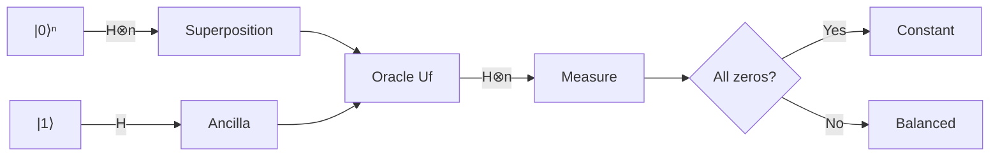

The Deutsch-Jozsa algorithm is one of the first examples showing that a quantum
computer can solve a problem exponentially faster than any classical
deterministic algorithm. It's a toy problem, but it's a great warm-up for
understanding how superposition and interference actually buy you something.

## The problem

Suppose we're given a function

$$
f : \{0, 1\}^n \to \{0, 1\}
$$

with a promise: $f$ is either **constant** (same output for every input) or
**balanced** (outputs $0$ for exactly half the inputs and $1$ for the other
half). We're allowed to query $f$ as a black box (an "oracle"), and we want to
decide which case we're in.

> Classically, in the worst case you need $2^{n-1} + 1$ queries to be certain.
> The Deutsch-Jozsa algorithm does it with a **single** query.
{: .prompt-tip }

## The circuit

We use $n$ input qubits initialized to $\lvert 0 \rangle^{\otimes n}$ and one
ancilla qubit initialized to $\lvert 1 \rangle$. After applying Hadamard gates
to every qubit, the oracle $U_f$, and Hadamard gates again to the input
register, measuring the input register in the computational basis tells us
the answer:

- All zeros → $f$ is **constant**
- Anything else → $f$ is **balanced**



## Simulating it with Qiskit

Here's a minimal simulation for $n = 3$ with a balanced oracle:

```python
from qiskit import QuantumCircuit
from qiskit_aer import AerSimulator
from qiskit import transpile

def deutsch_jozsa_circuit(n, oracle):
    qc = QuantumCircuit(n + 1, n)

    qc.x(n)          # ancilla -> |1>
    qc.h(range(n + 1))

    qc.compose(oracle, inplace=True)

    qc.h(range(n))
    qc.measure(range(n), range(n))
    return qc

def balanced_oracle(n):
    oracle = QuantumCircuit(n + 1)
    for qubit in range(n):
        oracle.cx(qubit, n)
    return oracle

n = 3
qc = deutsch_jozsa_circuit(n, balanced_oracle(n))

sim = AerSimulator()
result = sim.run(transpile(qc, sim), shots=1024).result()
counts = result.get_counts()
print(counts)
```

Running this gives a measurement distribution concentrated away from
`000`, confirming the oracle is balanced — in a single query.

## Why it works: interference

The core mechanism is that the Hadamard transform maps computational basis
states to an equal superposition with signs determined by parity:

$$
H^{\otimes n} \lvert x \rangle = \frac{1}{\sqrt{2^n}} \sum_{y \in \{0,1\}^n}
(-1)^{x \cdot y} \lvert y \rangle
$$

After the oracle imprints $f(x)$ as a phase on each branch, the second layer
of Hadamards causes constructive interference at $\lvert 0 \rangle^{\otimes n}$
**only if** $f$ is constant. If $f$ is balanced, the amplitude at
$\lvert 0 \rangle^{\otimes n}$ cancels exactly to zero.

## Takeaways

| Case     | Amplitude at $\lvert 0\rangle^n$ | Measurement outcome |
|----------|-----------------------------------|----------------------|
| Constant | $\pm 1$                           | Always `000...0`     |
| Balanced | $0$                                | Never `000...0`      |

It's not a practically useful algorithm on its own — the promise is
artificial and classical randomized algorithms solve it efficiently too — but
it's the cleanest illustration of how phase kickback and interference let a
quantum computer distinguish global properties of a function without
inspecting it pointwise.
